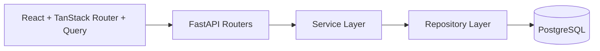

# Dispatch

Dispatch is a full-stack task management application with JWT authentication and a Kanban workflow.

## Architecture



## Stack

- Frontend: React 19, Vite, TypeScript, TanStack Query v5, TanStack Router, Tailwind v4, Shadcn UI, Framer Motion, `@hello-pangea/dnd`, Axios
- Backend: FastAPI, Pydantic v2, SQLAlchemy async, Alembic, PostgreSQL, Passlib/Bcrypt, python-jose
- Tooling: Docker Compose, Ruff, ESLint, Prettier, GitHub Actions

## Repository Layout

```text
backend/     # FastAPI application, migrations, services, repositories
frontend/    # React application, routes, hooks, UI components
docs/        # Sprint retrospectives and project docs
```

## Environment Variables

Set these values in `.env` (copy from `.env.example`):

| Variable | Description | Default |
| --- | --- | --- |
| `POSTGRES_USER` | Postgres user | `dispatch_user` |
| `POSTGRES_PASSWORD` | Postgres password | `dispatch_password` |
| `POSTGRES_DB` | Postgres database | `dispatch_db` |
| `POSTGRES_HOST` | Postgres host | `localhost` |
| `POSTGRES_PORT` | Postgres port | `5432` |
| `SQLALCHEMY_ECHO` | SQLAlchemy SQL logging toggle | `false` |
| `JWT_ACCESS_SECRET_KEY` | Access token signing key | `dispatch_access_secret_change_me` |
| `JWT_REFRESH_SECRET_KEY` | Refresh token signing key | `dispatch_refresh_secret_change_me` |
| `JWT_ALGORITHM` | JWT algorithm | `HS256` |
| `ACCESS_TOKEN_EXPIRE_MINUTES` | Access token lifetime (minutes) | `30` |
| `REFRESH_TOKEN_EXPIRE_DAYS` | Refresh token lifetime (days) | `7` |

## Quick Start (Docker)

1. Copy env file:
   - `cp .env.example .env`
2. Start Postgres:
   - `docker compose up -d postgres`
3. Run backend migrations:
   - `cd backend && uv run alembic upgrade head`
4. Start backend:
   - `uv run --directory backend python -m uvicorn app.main:app --reload --host 127.0.0.1 --port 8000`
5. Start frontend:
   - `cd frontend && npm install && npm run dev`

Frontend runs at `http://localhost:5173` and backend at `http://127.0.0.1:8000`.

## Manual Setup

### Backend

1. `cd backend`
2. `uv sync`
3. `uv run alembic upgrade head`
4. `uv run python -m uvicorn app.main:app --reload`

### Frontend

1. `cd frontend`
2. `npm install`
3. `npm run dev`

## API Documentation

- Swagger UI: `http://127.0.0.1:8000/docs`
- ReDoc: `http://127.0.0.1:8000/redoc`

### Main Endpoints

- `POST /auth/register`
- `POST /auth/login`
- `GET /users`
- `GET /tasks`
- `POST /tasks`
- `PUT /tasks/{task_id}`
- `DELETE /tasks/{task_id}`

## Quality Commands

### Backend

- Lint: `cd backend && uv run ruff check app`
- Migrations: `cd backend && uv run alembic current`

### Frontend

- Lint: `cd frontend && npm run lint`
- Build: `cd frontend && npm run build`
- Format check: `cd frontend && npm run format:check`

## Sprint Artifacts

- Sprint 0 retrospective: `docs/sprint-0-retrospective.md`
- Sprint 1 retrospective: `docs/sprint-1-retrospective.md`
- Sprint 2 retrospective: `docs/sprint-2-retrospective.md`
- Sprint 2 review runbook: `docs/sprint-2-review-runbook.md`
- Sprint plans: `sprint-0.md`, `sprint-1.md`, `sprint-2.md`
