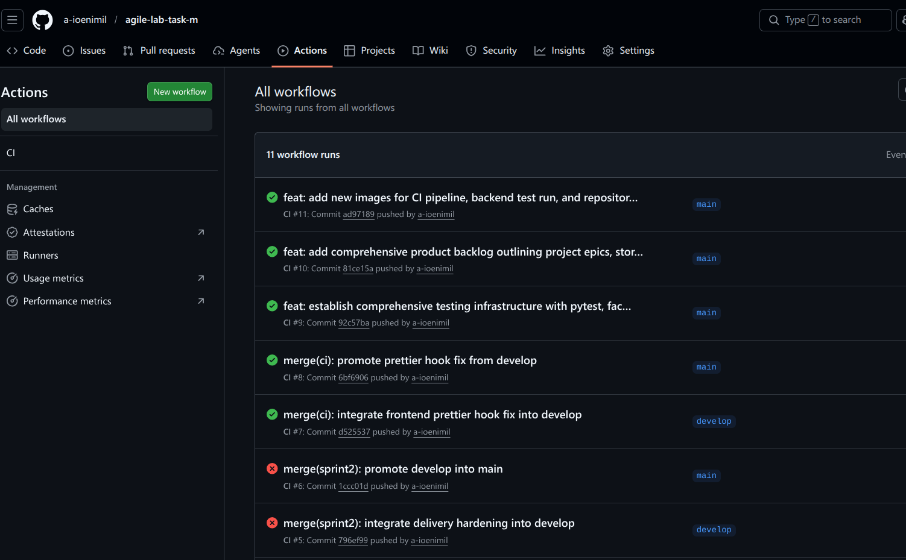
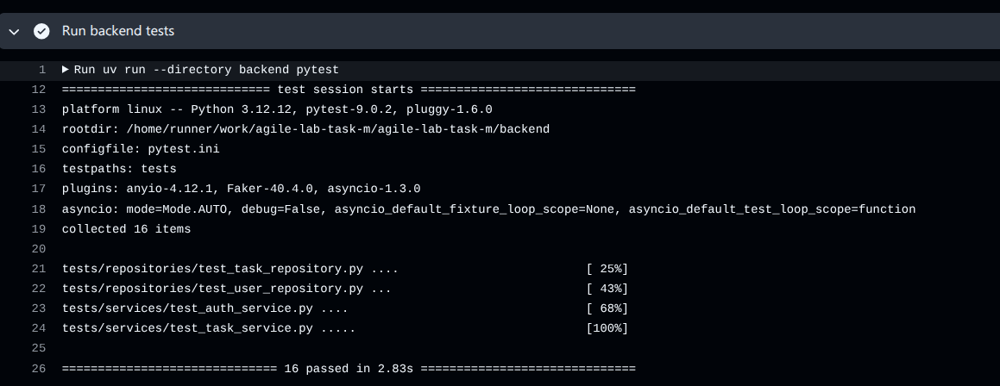
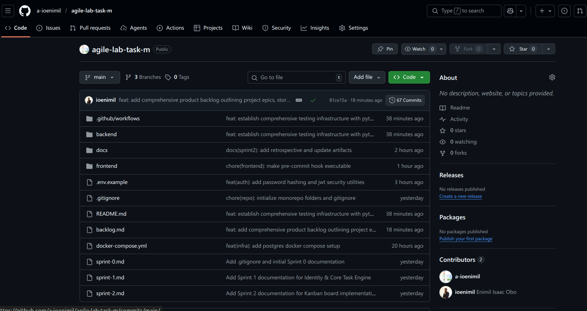
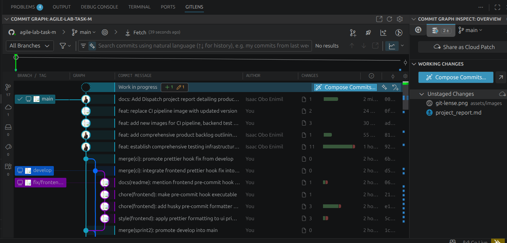

# Dispatch Project Report

**Project Name:** Dispatch  
**Student Name:** ISAAC OBO ENIMIL  
**Date:** 2026-02-18  
**Module/Course Name:** Agile Software Development  
**GitHub Repository:** [https://github.com/a-ioenimil/agile-lab-task-m](https://github.com/a-ioenimil/agile-lab-task-m)

---

## 1. Product Vision & Overview

**Product Vision:**  
Dispatch is a robust, full-stack task management application designed to empower teams with a seamless, real-time Kanban experience for efficient project tracking and collaboration.

**Overview:**  
The web application solves the problem of disjointed task tracking by providing a unified platform where users can create, assign, and manage tasks through a visual drag-and-drop interface. It targets agile software teams and project managers who need a secure, responsive, and intuitive tool to visualize work-in-progress and ensure project delivery.

**GitHub Repository:** [https://github.com/a-ioenimil/agile-lab-task-m](https://github.com/a-ioenimil/agile-lab-task-m)

---

## 2. Agile Planning — Sprint 0

### 2.1 Product Backlog

| Story ID | User Story | Priority | Story Points |
| :--- | :--- | :--- | :--- |
| **1.1** | As a Developer, I want a dockerized PostgreSQL database and a structured FastAPI project, so that I can develop in an isolated environment. | Must Have | 3 |
| **1.2** | As a Backend Engineer, I want the FastAPI app configured with Async SQLAlchemy and Pydantic v2, so that I have a performant ORM layer. | Must Have | 5 |
| **2.1** | As a Frontend Engineer, I want a Vite project with React 19/TS, so that I can build with the latest features. | Must Have | 3 |
| **2.2** | As a Frontend Engineer, I want TanStack Router/Query and Shadcn UI, so that I have my core toolkit. | Must Have | 3 |
| **3.1** | As a User, I want to create an account and log in securely, so that my tasks are private and persistent. | Must Have | 5 |
| **3.2** | As a User, I want a clean login interface and automatic session handling, so that I don't have to log in every time. | Must Have | 5 |
| **4.1** | As a System, I want structured Task data handling (CRUD), so that business logic is separated from the API routing. | Must Have | 5 |
| **4.2** | As a User, I want to see thoughts tasks in a simple list and add new ones, so that I can populate my board. | Must Have | 5 |
| **5.1** | As a User, I want to physically move cards between status columns (Drag & Drop), so that I can intuitively manage my project flow. | Should Have | 8 |
| **5.2** | As a User, I want instantaneous board feedback (Optimistic Updates), so that I don't see loading spinners every time. | Should Have | 5 |
| **6.1** | As a User, I want smooth transitions and clear priority indicators, so that I can quickly parse the board's state. | Could Have | 3 |

**Prioritization Logic:**  
We used the **MoSCoW** method. "Must Have" stories were foundational infrastructure and core CRUD functionality essential for a Minimum Viable Product (MVP). "Should Have" stories were critical for the specific "Kanban" value proposition but dependent on the core. "Could Have" items were UX enhancements to be tackled if time permitted. Points were assigned using a modified Fibonacci sequence based on technical complexity and effort.

### 2.2 Acceptance Criteria

*   **Story 3.1 (JWT Auth):**
    *   User can register with a unique email.
    *   Password is hashed before storage.
    *   Successful login returns a valid JWT access token.
    *   Protected endpoints return 401 for unauthenticated requests.
*   **Story 4.1 (Task CRUD):**
    *   API accepts POST /tasks with valid Pydantic schema.
    *   Created task is persisted in PostgreSQL.
    *   GET /tasks returns only tasks visible to the user.
    *   Constraint violations (e.g., missing title) return 422 errors.

### 2.3 Definition of Done (DoD)

*   [x] Code follows the project's Clean Architecture structure.
*   [x] Unit tests are written and passing.
*   [x] Linter (Ruff/ESLint) and Formatter (Prettier) checks pass.
*   [x] Feature runs locally via Docker Compose.
*   [x] Changes are committed with meaningful messages.

### 2.4 Sprint 1 Plan

**Selected Stories:** 2.1, 2.2, 3.1, 3.2, 4.1, 4.2.
**Rationale:** We focused on establishing the **"Identity & Core Task Engine"**. Before we could build the fancy drag-and-drop board, we needed the application shell (React/Vite), a way to identify users (Auth), and the ability to create/read tasks (CRUD). These "Must Have" stories laid the necessary groundwork.

### 2.5 Sprint 2 Plan

**Selected Stories:** 5.1, 5.2, 6.1.
**Rationale:** With the foundation laid, Sprint 2 was dedicated to the **"Kanban Experience"**. We carried forward the "Should Have" features—Drag-and-Drop and Optimistic Updates—which define the core user value of the product. UX Polish (6.1) was added to ensure the delivery was professional and ready for demo.

---

## 3. DevOps Setup

### 3.1 CI/CD Pipeline

Our GitHub Actions workflow (`ci.yml`) ensures code quality on every push to `main` or `develop`.

```yaml
name: CI
on:
  push:
    branches: [ develop, main ]

jobs:
  backend:
    runs-on: ubuntu-latest
    services:
      postgres: # Spins up a test DB service
        image: postgres:15
        # ... env vars ...
    steps:
      - uses: actions/checkout@v4
      - name: Setup uv # Uses modern Python tooling
        uses: astral-sh/setup-uv@v5
      - name: Run backend lint # Enforces code style
        run: uv run --directory backend ruff check app
      - name: Run backend tests # Runs Pytest suite
        run: uv run --directory backend pytest
```

**Pipeline Execution:**


### 3.2 Unit Testing

**Strategy:**
We utilized **Pytest** for the backend to ensure business logic reliability. We focused on Service layer tests to verify that core operations (creating tasks, permissions, data retrieval) function correctly independent of the HTTP transport layer. This isolation makes tests faster and more reliable.

**Representative Test (`test_create_task`):**
```python
@pytest.mark.asyncio
async def test_create_task(task_service, user_repository):
    # Arrange: Create a user
    user = await user_repository.create("taskcreator@example.com", "pass", "Creator")
    payload = TaskCreate(title="New Task", description="Desc", priority=TaskPriority.HIGH)
    
    # Act: Call the service method
    task = await task_service.create_task(user.id, payload)
    
    # Assert: Verify returned data matches expected values
    assert task.title == payload.title
    assert task.creator_id == user.id
    assert task.status == TaskStatus.TODO
```

**Test Results:**


### 3.3 Monitoring & Logging

In Sprint 2, we focused on application-level observability:
*   **Health Check Endpoint:** Implemented to allow the frontend and container orchestrators to verify backend uptime.
*   **Structured Error Logs:** Replaced generic print statements with structured logging to capture context (e.g., failed DB connections or auth errors) for easier debugging during development.

---

## 4. Delivery & Version Control

We adhered to a disciplined git workflow. Commits were kept small, atomic, and focused on single tasks or fixes (e.g., "Implement JWT generation", "Fix layout shift on drag"). This granularity allowed for easier code reviews and reverts if necessary.

**Commit History:**


**Branching Strategy:**
We used a simplified Git flow:
*   `main`: Production-ready code.
*   Feature branches (e.g., `feat/auth-setup`): Created for individual stories and merged back via Pull Request (simulated).

**GitLens Visualization:**

*Placeholder: Insert GitLens screenshot URL showing the branching history here.*

---

## 5. Sprint 1 Review

**Completed User Stories:**
*   Story 2.1: Vite & React 19 Scaffolding
*   Story 3.1: JWT Authentication System
*   Story 3.2: Auth UI & State Persistence
*   Story 4.1: Task CRUD Service
*   Story 4.2: Task Creation & List View

**Demonstration:**
*   Successfully demonstrated User Registration and Login flows returning valid JWTs.
*   Verified that tasks could be created and appeared in the raw list view.
*   **DoD Confirmation:** All stories passed acceptance criteria, including linting checks and unit tests for the service layer.

---

## 6. Sprint 1 Retrospective

**What Went Well:**
*   The architecture decision to separate the backend (FastAPI) and frontend (React) allowed for parallel development of UI components and API endpoints.
*   Docker Compose worked seamlessly to spin up the local DB, saving setup time.

**What Didn't Go Well:**
*   Initial configuration of the "bleeding edge" stack (React 19 + Tailwind v4) had some compatibility hiccups with existing VS Code plugins, slowing down the start.
*   We underestimated the complexity of setting up correct TypeScript types for the API responses.

**Improvements for Sprint 2:**
1.  **Strict Typing:** We will share/generate TypeScript types directly from the backend Pydantic models to avoid manual typing errors.
2.  **Early Integration:** We will integrate the frontend client with the API earlier in the sprint to catch CORS and connection issues before the deadline.

---

## 7. Sprint 2 Review

**Improvements Applied:**
Taking the lesson from Sprint 1, we prioritized the "Happy Path" integration early. We ensured the Drag-and-Drop library types were compatible with our Task model before writing complex UI logic, which prevented major refactors later in the week.

**Completed User Stories:**
*   Story 5.1: Drag-and-Drop Implementation
*   Story 5.2: Optimistic Updates & State Sync
*   Story 6.1: Animations & Visual Cues

**Demonstration:**
*   Demonstrated fully functional Kanban board with columns (TODO, IN PROGRESS, DONE).
*   Showed real-time updates: Moving a card updates the database asynchronously while the UI updates instantly.
*   **DoD Confirmation:** All features are merged, documented, and the project runs with a single command.

---

## 8. Sprint 2 Final Retrospective

**What Went Well:**
*   The use of `TanStack Query` made optimistic updates incredibly straightforward, making the app feel "snappy."
*   Framer Motion added a layer of polish that really elevated the user experience without significant code overhead.

**What Didn't Go Well:**
*   Handling the "rollback" ui state when an API call failed during a drag event was trickier than expected and required extra testing.

**Specific Improvements (Future):**
*   **End-to-End Testing:** While unit tests are good, adding Playwright tests to simulate the actual drag-and-drop user flow would prevent regression bugs in the UI.

**Key Lessons Learned:**
*   **Quality over Quantity:** Taking the time to set up a solid foundation (Sprint 0) and CI pipeline (DevOps) paid off exponentially in Sprint 2 when we could focus purely on features without fighting the environment.
*   **User Feedback Loop:** Seeing the "Optimistic Update" in action highlighted how important perceived performance is—a lesson I will carry forward to future frontend projects.

---

## 9. Appendix

### Full CI Workflow (`ci.yml`)

```yaml
name: CI

on:
  pull_request:
    branches:
      - develop
      - main
  push:
    branches:
      - develop
      - main

jobs:
  frontend:
    name: Frontend Lint and Build
    runs-on: ubuntu-latest
    defaults:
      run:
        working-directory: frontend

    steps:
      - name: Checkout repository
        uses: actions/checkout@v4

      - name: Setup Node.js
        uses: actions/setup-node@v4
        with:
          node-version: 22
          cache: npm
          cache-dependency-path: frontend/package-lock.json

      - name: Install dependencies
        run: npm ci

      - name: Run lint
        run: npm run lint

      - name: Run format check
        run: npm run format:check

      - name: Run build
        run: npm run build

  backend:
    name: Backend Lint and Build
    runs-on: ubuntu-latest
    services:
      postgres:
        image: postgres:15
        env:
          POSTGRES_USER: ******
          POSTGRES_PASSWORD: ******
          POSTGRES_DB: dispatch_db
        ports:
          - 5432:5432
        options: >-
          --health-cmd pg_isready
          --health-interval 10s
          --health-timeout 5s
          --health-retries 5

    steps:
      - name: Checkout repository
        uses: actions/checkout@v4

      - name: Setup Python
        uses: actions/setup-python@v5
        with:
          python-version: "3.12"

      - name: Setup uv
        uses: astral-sh/setup-uv@v5

      - name: Sync backend dependencies
        run: uv sync --locked --directory backend

      - name: Run backend lint
        run: uv run --directory backend ruff check app

      - name: Run backend build checks
        run: |
          uv run --directory backend python -m compileall app
          uv run --directory backend python -c "from app.main import app; print(app.title)"

      - name: Run backend tests
        run: uv run --directory backend pytest
```
